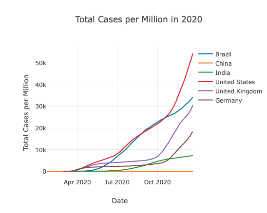
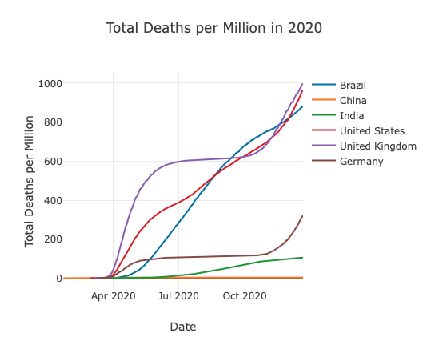

## Covid-19 dashboard

### Table of Contents

1. [Installation/Running](#installation)
2. [Motivation](#motivation)
3. [Repository Structure](#repo)
4. [Results](#results)


## Installation/Running <a name="installation"></a>

Create a virtual environment named **covid19**.

```
$ python3 -m venv covid19 -- for Linux and macOS
$ python -m venv covid19 -- for Windows
```

After that, activate the python virtual environment

```
$ source covid19/bin/activate -- for Linux and macOS
$ covid19\Scripts\activate -- for Windows
```

Install the requirements

```
$ pip install -r requirements.txt
```

To run

```
$ python myapp.py
```

## Motivation <a name="motivation"></a>

This was an activity of the Data Science Nanodegree I am taking at Udacity.
This is a Small Covid-19 Data Dashboard using flask as the backend, plotly to build the data visualizations and
pandas to do the data wrangling.

## Repository Structure <a name="repo"></a>

- The `data` folder contain the information about the covid-19.
- The `myapp` folder with the index.html, images used at the dashboard and routes.py.
- The `wrangling_scripts` folder with the scripts needed to do the data wrangling.
- The `requirements.txt` has the needed packages to run the notebook.
- The `myapp.py` it is the main file.
- The `assets` folder with the images used at the README.

## Results <a name="results"></a>

Despite the fact that China and India are the two countries with the largest population
They are the countries in my samplings that have the least cases and deaths per million. 
More iterative plots can be found [here](https://covid-19-data-dashboard-wow.herokuapp.com).



